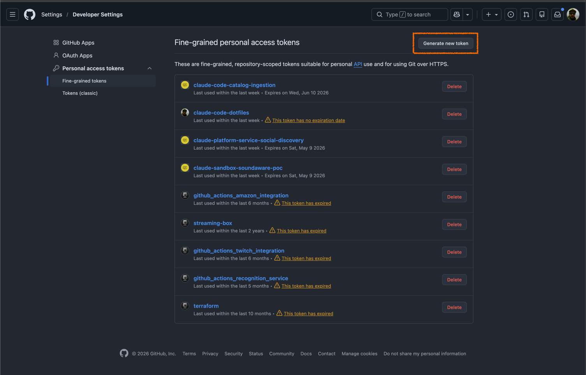
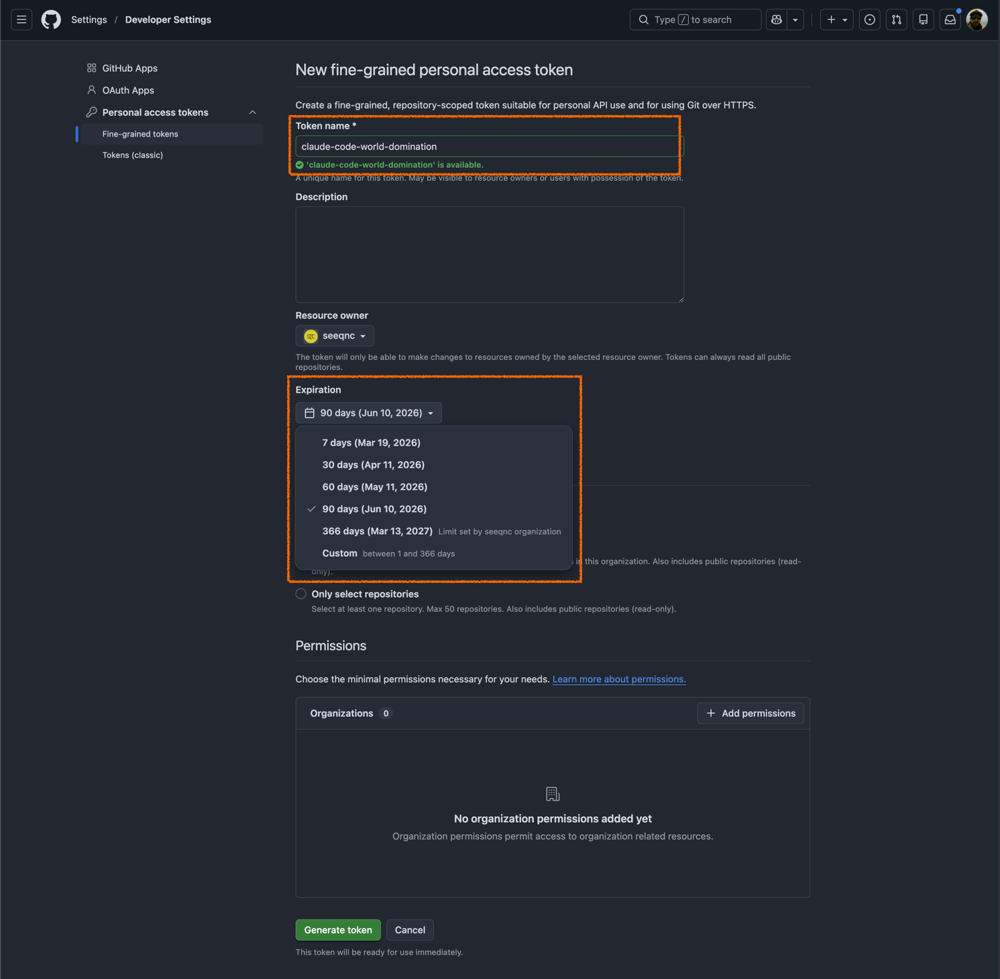
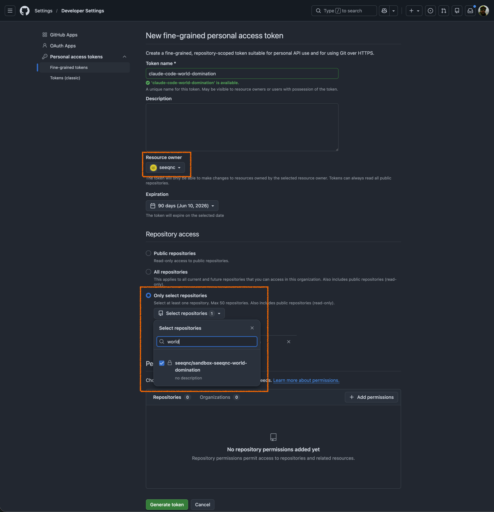
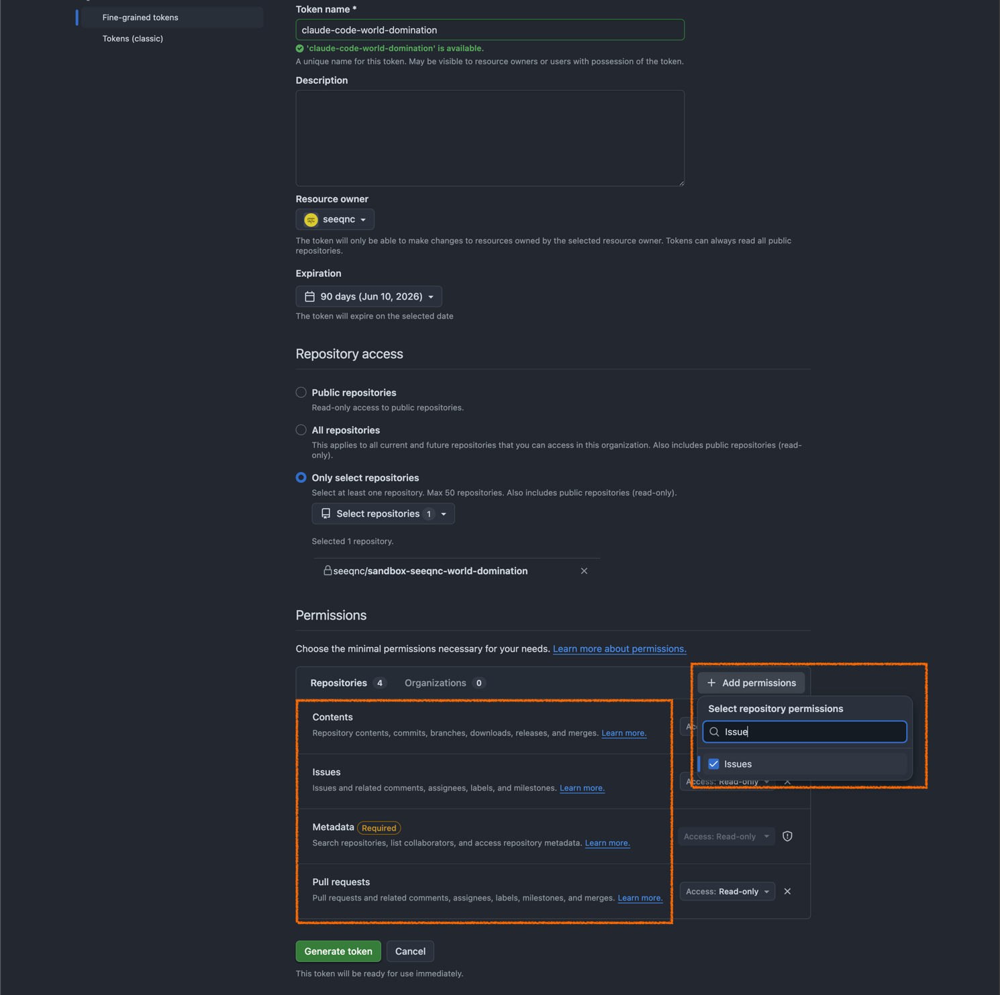
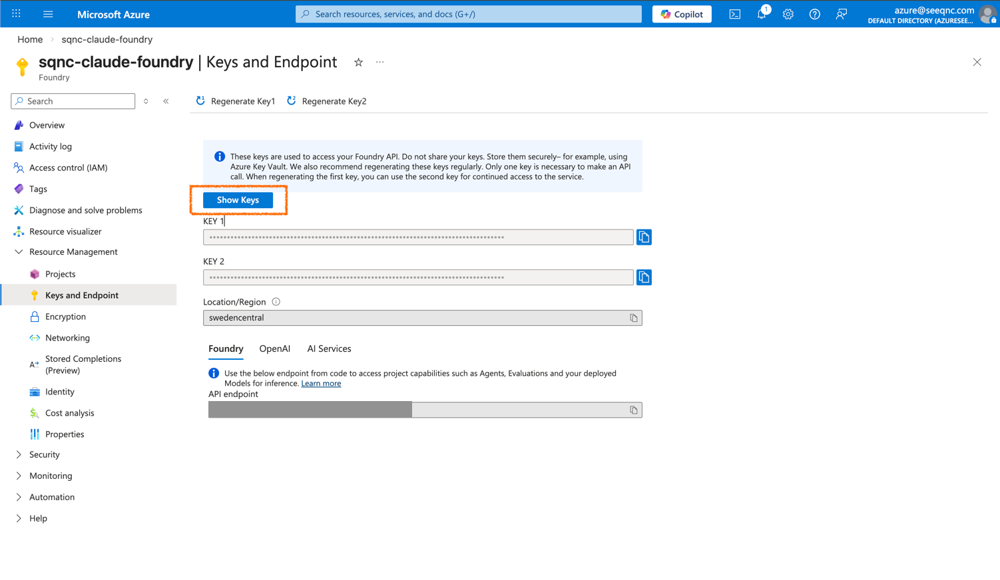

# Getting started

How to get Claude Code running in a sandboxed devcontainer. The full [README](README.md) covers edge cases if you get stuck.

## 1. Install the devc CLI

You need Docker running (Docker Desktop, OrbStack, or Colima all work) and Node.js for the devcontainer CLI.

```bash
# Install the devcontainer CLI (one-time)
npm install -g @devcontainers/cli

# Clone this repo and install the devc helper
git clone https://github.com/seeqnc/claude-code-devcontainer ~/.claude-devcontainer
~/.claude-devcontainer/install.sh self-install
```

Make sure `~/.local/bin` is in your PATH. If `devc` doesn't work after install, add this to your shell profile:

```bash
export PATH="$HOME/.local/bin:$PATH"
```

## 2. Set up a project

Go to the repo you want to work in and run:

```bash
cd ~/Projects/sandbox-seeqnc-world-domination
devc .
```

This copies the devcontainer template into `.devcontainer/` and starts the container. Done.

**When do you need `devc rebuild`?** Any time you change an environment variable (API keys, tokens), update the Dockerfile, or modify `devcontainer.json`. The container reads env vars at creation time, so changes won't take effect until you rebuild:

```bash
devc rebuild
```

Your shell history, Claude settings, and GitHub auth survive rebuilds. They live in Docker volumes.

## 3. Create a GitHub personal access token

The `GH_TOKEN` is a fine-grained PAT scoped to the repos you're working on. This is deliberate: a scoped token limits the blast radius if something goes wrong inside the container.

### Step by step

1. Go to [https://github.com/settings/personal-access-tokens](https://github.com/settings/personal-access-tokens)

2. Click **Generate new token**

   > 

3. Give it a descriptive name (e.g., `claude-devcontainer`) and set an expiration

   > 

4. Under **Repository access**, select the specific repo you'll be working on

   > 

5. Under **Permissions**, grant the following (all need both **Read** and **Write**):

   | Permission       | Why                              |
   |------------------|----------------------------------|
   | **Contents**     | Push commits, read files         |
   | **Pull requests**| Create and edit PRs              |
   | **Issues**       | Create and comment on issues     |

   > 

6. Click **Generate token** and copy it immediately. You won't see it again.

## 4. Get the OpenAI API key from Azure portal

The Codex CLI uses an Azure-hosted OpenAI endpoint. You need an API key from the Azure portal.

> **Portal link:** Go to the [Azure portal](https://portal.azure.com), navigate to your Azure OpenAI resource, then **Keys and Endpoint**.
>
> 

Copy either `KEY 1` or `KEY 2`.

You also need the Azure endpoint URL. It's on the same Keys and Endpoint page in the portal — copy the **Endpoint** value.

## 5. Export env vars and rebuild

Now that you have your tokens, store them in the `.devc.env` file. `devc rebuild` reads this file automatically.

```bash
# Create .devc.env from the template (one-time)
cd ~/.claude-devcontainer
cp .devc.env.example .devc.env

# Edit .devc.env and fill in your values
$EDITOR .devc.env
```

The `.devc.env` file looks like this — fill in the values you have:

```bash
GH_TOKEN=github_pat_...
OPENAI_API_KEY=...
CODEX_AZURE_BASE_URL=https://your-endpoint.openai.azure.com/openai/v1/
EXA_API_KEY=...
DEVC_API_PORT=8000
```

Then rebuild:

```bash
devc rebuild
```

The `.devc.env` file is gitignored and never enters the container — Claude cannot read it. If you change a key later, edit `.devc.env` and run `devc rebuild` again.

## 6. Start the container

```bash
devc shell
```

You're inside the devcontainer now. Your project files are mounted at `/workspace`.

## 7. Run Claude Code

First time? Log in with your subscription account:

```bash
claude login
```

This opens a browser flow. Your login persists across rebuilds (stored in a Docker volume), so you only do this once.

Normal mode, where Claude asks before running commands:

```bash
claude
```

Yolo mode, where Claude runs everything without asking:

```bash
claude-yolo
```

That's shorthand for `claude --dangerously-skip-permissions`. Sounds scary. It isn't. Keep reading.

## 8. Why yolo mode is safe here

On your actual machine, `--dangerously-skip-permissions` is exactly what it sounds like. Claude can delete files, run arbitrary commands, do whatever it wants.

Inside this devcontainer, that's fine.

Claude can only see `/workspace`. Your home directory, SSH keys, cloud credentials, and other projects don't exist in here.

Even in yolo mode, [pre-tool-use hooks](.claude/settings.json) intercept every command before it runs. They block `eval`, `LD_PRELOAD`, shell injection vectors, credential env var overwrites (`GH_TOKEN`, `ANTHROPIC_API_KEY`, etc.), destructive `gh` operations (merge, delete), `rm -rf /`, Docker socket access, cloud CLI operations, and database drops.

The `.devcontainer/` directory is mounted read-only inside the container, so a compromised process can't modify the Dockerfile or `devcontainer.json` to inject commands that run on your host during the next rebuild. Your fine-grained PAT only has access to the repos you selected. Claude's config and shell history live in Docker volumes, not on your host filesystem.

The container is the sandbox. Yolo mode gives you unrestricted Claude that can't reach anything that matters.

In short you can yolo through your day without worrying about security. Ok don't take that too seriously.

## 9. Codex CLI and /review-pr

The container comes with [OpenAI Codex CLI](https://github.com/openai/codex) pre-installed and configured to use the Azure OpenAI endpoint. You don't need to set anything up beyond the `OPENAI_API_KEY` and `CODEX_AZURE_BASE_URL` from step 4.

When you run `/review-pr` in Claude, it uses Codex as an independent reviewer. If you also have `GEMINI_API_KEY` set, Gemini CLI adds a third opinion on the same diff.

Verify Codex is working:

```bash
which codex      # should print a path
codex --help     # should show usage
```

You can also run Codex directly from the container.

**Note:** Codex CLI is a separate product from Claude. It doesn't have the same guardrails, so be careful if you run it directly. Don't run `codex --dangerously-bypass-approvals-and-sandbox` in this container. We might implement something similar to the guardrails for Claude later for Codex if there is demand for it.

## 10. Quick reference

| What                            | Command                                    |
|---------------------------------|--------------------------------------------|
| Start container                 | `devc up`                                  |
| Open shell                      | `devc shell`                               |
| Rebuild (after env changes)     | `devc rebuild`                             |
| Stop container                  | `devc down`                                |
| Run Claude                      | `claude`                                   |
| Run Claude (yolo)               | `claude-yolo`                              |
| Upgrade Claude to latest        | `devc upgrade`                             |
| Show container env vars         | `devc env`                                 |
| Mount host dir into container   | `devc mount ~/data /data`                  |
| Update devc itself              | `devc update`                              |
| Check GitHub auth               | `gh auth status`                           |
